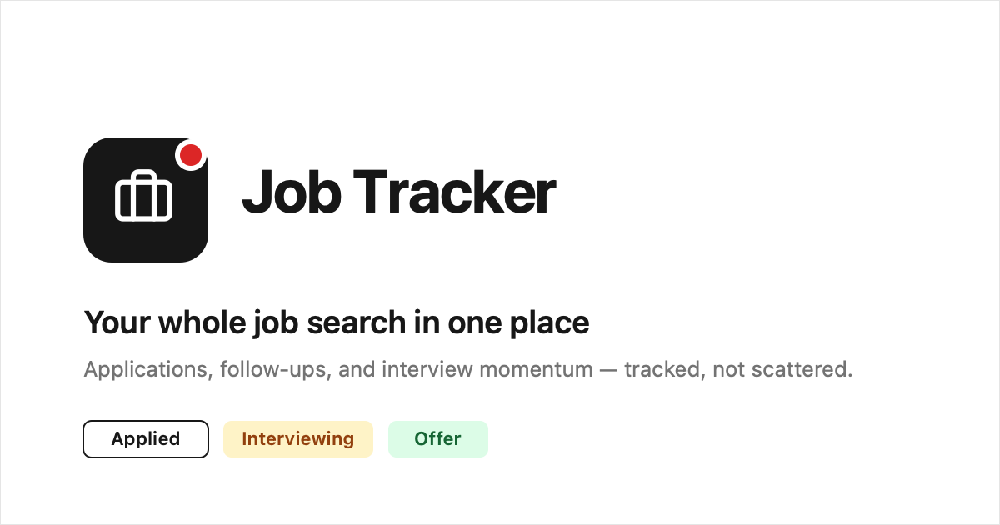
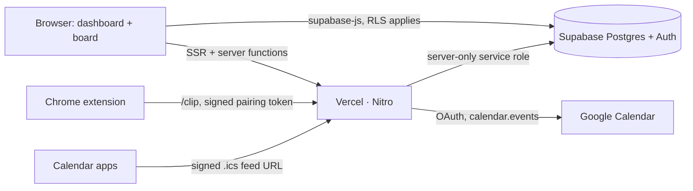

<p align="center">
  
</p>

<p align="center">
  <a href="https://job-tracker-rho-khaki-34.vercel.app"><b>Live app →</b></a>
  ·
  <a href="#features">Features</a>
  ·
  <a href="#how-its-built">How it's built</a>
  ·
  <a href="#run-it-yourself">Run it yourself</a>
</p>

<p align="center">
  
  
  
  
  
  
  
  <a href="https://github.com/andriuskleinas/job-tracker/actions/workflows/ci.yml"></a>
  
</p>

# Job Tracker

**Every application, follow-up and interview in one workspace.** Clip a job ad from LinkedIn,
Greenhouse, Lever, Ashby or Workday with one click, see what's due today first, and watch your
pipeline move from wishlist to offer.

It's a deployed product, built end to end: product design, database security, a browser
extension, calendar integration and analytics.

## Features

| | Feature | What it does |
|---|---|---|
| 🗂️ | **Pipeline board** | Every application as a card in its stage (wishlist, applied, interviewing, offer), with drag-to-advance and a keyboard move menu. Rejected and withdrawn roles move to an archive. |
| ✂️ | **Clip to Job Tracker** | A Chrome extension that reads the job ad already open in your tab and saves salary, requirements and the full text. Site adapters for LinkedIn, Greenhouse, Lever, Ashby and Workday, plus a generic fallback. |
| ✅ | **Follow-up tasks** | Dated tasks attached to any application. What's due today rises to the top of the list, and overdue follow-ups are flagged on the card. |
| 📅 | **Google Calendar sync** | Open, dated tasks become calendar events and stay in step as you edit, complete or delete them. Any calendar app can subscribe to a signed iCal feed instead. |
| 📈 | **Analytics** | A funnel from wishlist to offer, median days to first response and between stages, and date-range filters. |
| ⏱️ | **Status history** | Every stage change is timestamped, so you know how long each company takes to respond. |
| 📥 | **CSV import** | Bring an existing spreadsheet in through a downloadable template. |
| 🏢 | **Company logos** | Each card shows the company's icon, read from the site's declared favicon when Google's service has none. |

## How it's built



| Layer | Choices |
|---|---|
| **Frontend** | [TanStack Start](https://tanstack.com/start) (file-based routing, SSR), React 19, Tailwind CSS 4, shadcn/ui on Radix primitives, Recharts for analytics |
| **Backend** | TanStack Start server functions, plus a custom server entry that serves the calendar feed, extension and logo endpoints ahead of the router; CSRF middleware on app requests |
| **Database** | Supabase Postgres with row-level security on all 7 tables, 15 versioned SQL migrations, timestamped status-change events |
| **Extension** | Chrome Manifest V3 with only `activeTab`, `scripting` and `storage` permissions; runs when you click it and shares the app's job-ad parser |
| **Integrations** | Google Calendar API over OAuth (one-way push, `calendar.events` scope) and an HMAC-signed iCal feed |
| **Auth** | Supabase Auth with email and password, password reset, and a 30-minute idle sign-out |
| **Testing & CI** | `bun test` unit tests for the feed, extension, logo and analytics logic; GitHub Actions runs lint, typecheck, tests and build on every push |
| **Hosting** | Vercel through the Build Output API (Nitro `vercel` preset), deployed from `main` |

### Engineering highlights

- **Row-level security is the access boundary.** Every table is scoped to its owner in Postgres,
  so each user sees their own search and nobody else's. The service-role key lives only on the
  server, for the endpoints that act without a browser session: the calendar feed, the extension
  and Google Calendar sync.
- **Two tokens, two scopes.** The extension pairing code and the calendar feed URL are both HMACs
  under the same key, but the clip token hashes a `clip:` prefix and each verifier rejects the
  other's tokens. A shared feed URL grants read access to tasks and nothing more.
- **Clipping reads the page you already have open.** The extension parses the DOM rendered in your
  tab and makes zero requests to the job site, which keeps your LinkedIn or Workday session out of
  it. Each adapter falls back to the page's visible text, so a site redesign affects how many
  fields are pre-filled while the capture still lands.
- **One parser, two entry points.** The website's paste box and the extension import the same
  `src/lib/job-ad.ts`, so salary and requirement parsing improve in both at once.
- **Calendar sync that tracks every change.** Creating, editing, completing and deleting a task
  each map to the matching Google Calendar operation, with event IDs stored per task.

## Run it yourself

You need [Bun](https://bun.sh) and a [Supabase](https://supabase.com) project. Google Calendar sync
and the extension are optional.

```bash
git clone https://github.com/andriuskleinas/job-tracker.git
cd job-tracker
bun install
cp .env.example .env   # fill in your own keys; never commit .env
bun run dev            # http://localhost:8080
```

Apply the SQL files in [`supabase/migrations/`](supabase/migrations) to your Supabase project, in
order. The app reads `VITE_SUPABASE_*` in the browser and the `SUPABASE_*` equivalents during SSR.

- **Google Calendar sync:** see [docs/google-calendar-sync.md](docs/google-calendar-sync.md).
- **Browser extension:** run `bun extension/build.ts`, then load `extension/dist` unpacked. See
  [extension/README.md](extension/README.md).

### Checks

```bash
bun run lint         # eslint + prettier
bunx tsc --noEmit    # typecheck
bun test             # unit tests
bun run build        # production build
```

The same steps run in [CI](.github/workflows/ci.yml) on every push and pull request.

### Deployment

`bun run build` runs Vite with Nitro's `vercel` preset and emits `.vercel/output`, which Vercel
deploys directly (configured in [`vercel.json`](vercel.json)). Set the `SUPABASE_*`,
`VITE_SUPABASE_*` and optional Google variables in the Vercel project settings.

## Project layout

```
src/routes/              landing, auth, and the signed-in app (dashboard, applications, analytics, account)
src/components/          board, cards, filters, task form, calendar and extension dialogs
src/lib/                 job-ad parser, status model, stats, calendar feed and sync, server endpoints
src/server.ts            server entry: calendar feed, /clip and /logo routes ahead of the router
extension/               Chrome MV3 extension: site adapters, popup, build script
supabase/migrations/     schema, RLS policies, calendar tables
docs/                    Google Calendar setup, voice and tone guide
```

## License

[MIT](LICENSE) © Andrius Kleinas
